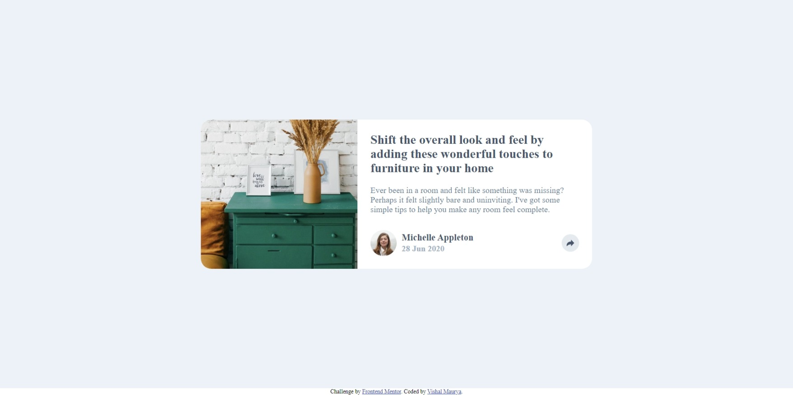
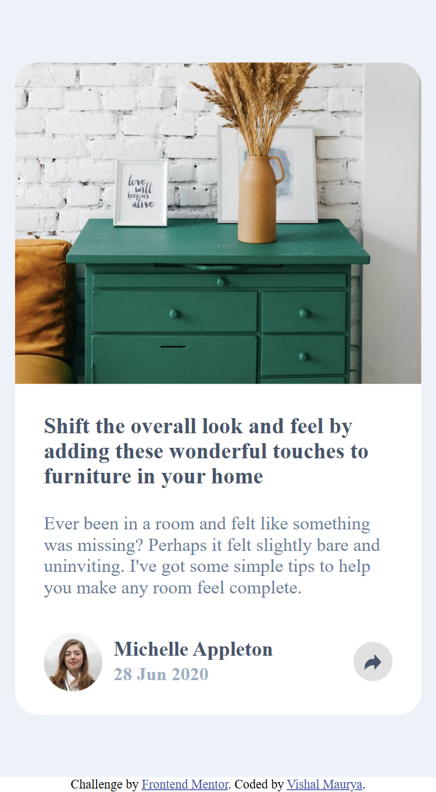

# Frontend Mentor - Article preview component solution

This is a solution to the [Article preview component challenge on Frontend Mentor](https://www.frontendmentor.io/challenges/article-preview-component-dYBN_pYFT)

## Table of contents

- [Frontend Mentor - Article preview component solution](#frontend-mentor---article-preview-component-solution)
  - [Table of contents](#table-of-contents)
  - [Overview](#overview)
    - [The challenge](#the-challenge)
    - [Screenshot](#screenshot)
    - [Links](#links)
  - [My process](#my-process)
    - [Built with](#built-with)
  - [Author](#author)

## Overview

### The challenge

Users should be able to:

- View the optimal layout for the component depending on their device's screen size
- See the social media share links when they click the share icon

### Screenshot

### Links
- Solution URL: [Click Here](https://www.github.com/VishalMauryastp/article-preview-component-master)
- Live Site URL: [Click Here](https://vishalmauryastp.github.io/article-preview-component-master/)

## My process

### Built with

- Semantic HTML5 markup
- CSS custom properties
- Flexbox
- Mobile-first workflow
- Scss/sass
- JavaScript/JQuery

## Author

- Github - [@VishalMauryastp](https://www.github.com/VishalMauryastp)
- Frontend Mentor - [@VishalMauryastp](https://www.frontendmentor.io/profile/VishalMauryastp)
- LinkedIn - [@Vishal Maurya](https://www.twitter.com/yourusername)
